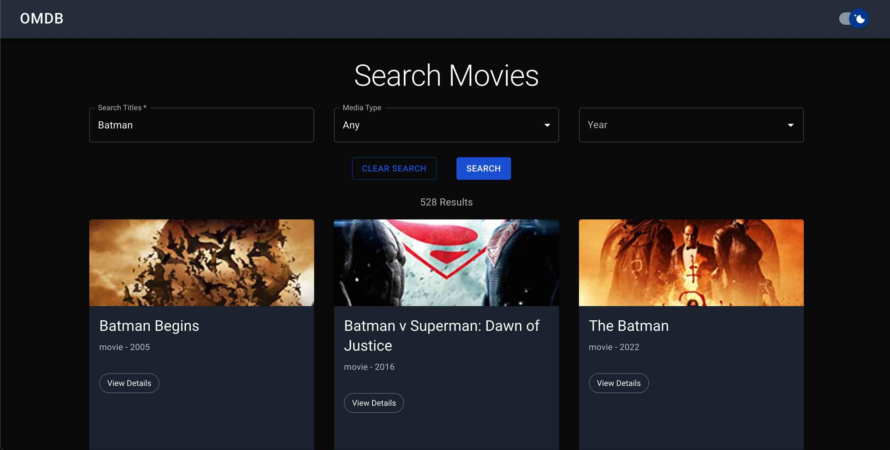

# TEA-React-Project



## Built With

- Next.js
- Typescript
- MUI
- [OMDb API](https://www.omdbapi.com)

## Features

- ServerSide Rendering
- Mobile Responsive
- Infinite Scrolling through pagination on the Search screen
- Global State management with react context
- Next.js pages and query strings
- Custom MUI theme changes
- Light and Dark Modes (persisted with localStorage)
- Testing with Jest and Testing Library/React
- CI/CD with Netlify and Github (production builds on pushes to main, builds must pass all tests to be deployed to production)

## Live Link

https://tea-omdb-moviesearch.netlify.app/

## Approach

I decided to approach this challenge through iterations. These iterations can be seen in the branches that are included in the repo. I also have details about each branch and iteration in the the /docs directory if you would like to learn more.

I took this approach so that at each stage of the process I would have a working solution. I think it's important in software development to always start with working parts. That way, if timelines get moved up, you can deliver working solutions at any given time. It also gives you more time to work on extra features since you have already completed the mvp for the project.

Here are the branches listed in order of development.

1. mvp
2. improved-search
3. infinite-scroll
4. testing-and-refactor
5. light-and-dark-mode

You can read more details on what I was think about and changed with each branch in the docs folder.

## Run/Develope Locally

1. First, make sure to clone this repo on your local machine

```bash
git clone https://github.com/Mark-Mulligan/tea-react-project.git
```

2. Next, make sure to install all the app dependencies using a node package manager

```bash
npm install
# or
yarn install
# etc
```

3. Create a .env.local file in the root of the project. Make sure to copy the .env.example for the variables. Most of the variables in the example have values that work for local development. You will need to get an api key from [OMDb API](https://www.omdbapi.com). You can follow the instructions [here](https://www.omdbapi.com/apikey.aspx) to get your key for development. Free keys have a limit of 1000 request per day.

4. To start the instance locally, run the following command

```bash
npm run dev
# or
yarn run dev
# etc
```

If all the steps above were followed correctly, you should have a working version of the app running on your system. Navigate to localhost:3000 in the browser to view the app.

## Testing

There are a series of unit and integration tests featured to check the functionality of the application. These tests are located in the **tests** directory.

To run all tests, run the following command:

```bash
npm run test
```

You can also run individual tests suites using the jest CLI. More information on that can be found [here](https://jestjs.io/docs/cli). You may need to install this globally if you don't already have it on your machine.

## Build

To create a build locally, run the following command:

```bash
npm run build
```

This command will first run the tests in the **tests** folder. If all tests pass, then the a production build of the applicaiton will be generated. The build files will be located in the .next directory.

## My other work

Feel free to check out some of the other things I have been working on.

[Personal Portfolio](https://markmulligan.dev) - Displays my experience and recent projects

## Learn More About Next

To learn more about Next.js, take a look at the following resources:

- [Next.js Documentation](https://nextjs.org/docs) - learn about Next.js features and API.
- [Learn Next.js](https://nextjs.org/learn) - an interactive Next.js tutorial.

You can check out [the Next.js GitHub repository](https://github.com/vercel/next.js/) - your feedback and contributions are welcome!
